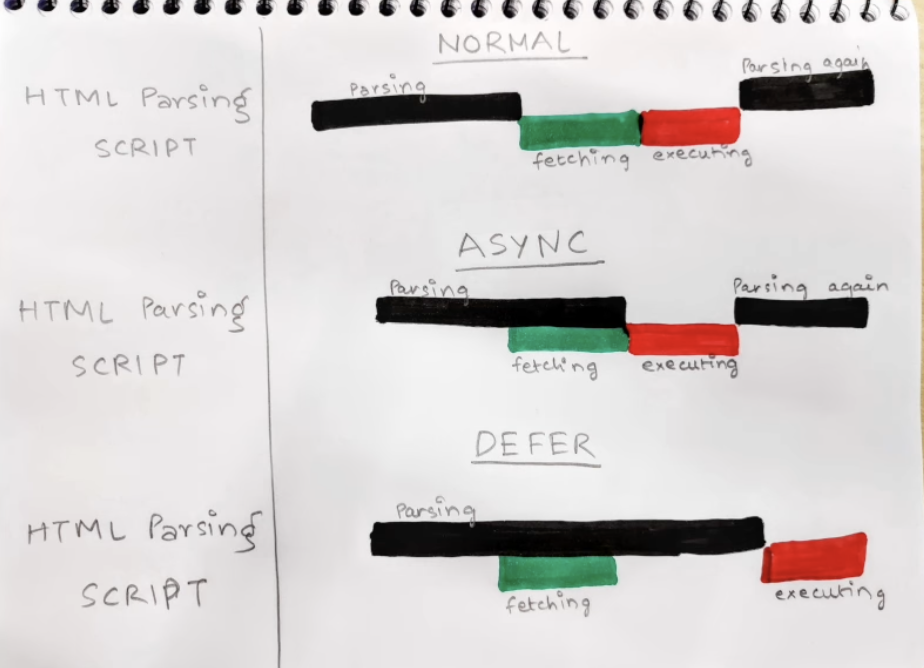

# What is Emmet?
-
# Difference between a Library and Framework?

# What is CDN? Why do we use it?

# Why is React known as React?

# What is cross-origin in the script tag?

# What is the difference between React and ReactDOM

# What is difference between react.development.js and react.production.js files via CDN?

# What are async and defer attributes?
- These are boolean attributes which are used along with script tags to load the external scripts efficiently into our webpage.
- When you load your webpage two major things happens in web browser:
    - HTML Parsing
    - Loading of the scripts
        - Fetching the scripts from network
        - Actually, executing the script line by line
- Normally, as soon as the script tag is encountered the HTML parsing stops and parser waits until the script is fetched and executed
- With async, the execution of HTML parsing goes on even encountering script tag, and the fetching process happens parallel to the parsing and as the fetching is completed then only HTML parsing stops and browser executes script.
- With defer, the execution of HTML doesn't stop after encountering script tag, scripts are fetched parallelly but executed after HTML parsing. It is only executed once HTML parsing is complete i.e. at the end of parsing.

- The async attribute doesn't guarantee the order of execution of scripts but defer does.
- If the scripts depends on each other and requires a order then go for defer.
- If the scripts are independent of each other like analytics script, etc then go for async.

# createElement
- createElement lets you create a React element. It serves as an alternative to writing JSX.
- const element = createElement(type, props, ...children)
- Parameters: 
    - type
    - props
    - children (optional)
- Both coding styles (legacy and JSX) are fine, so you can use whichever one you prefer for your project. The main benefit of using JSX compared to createElement is that it’s easy to see which closing tag corresponds to which opening tag.

# References
- https://react.dev/reference/react/createElement
- https://www.youtube.com/watch?v=IrHmpdORLu8