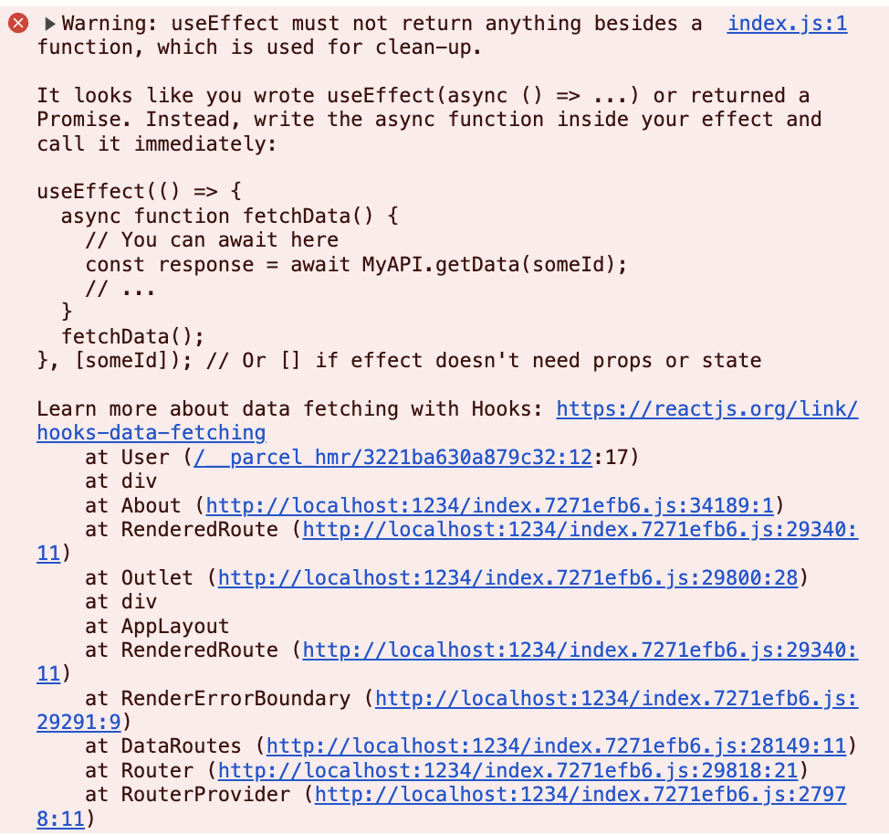
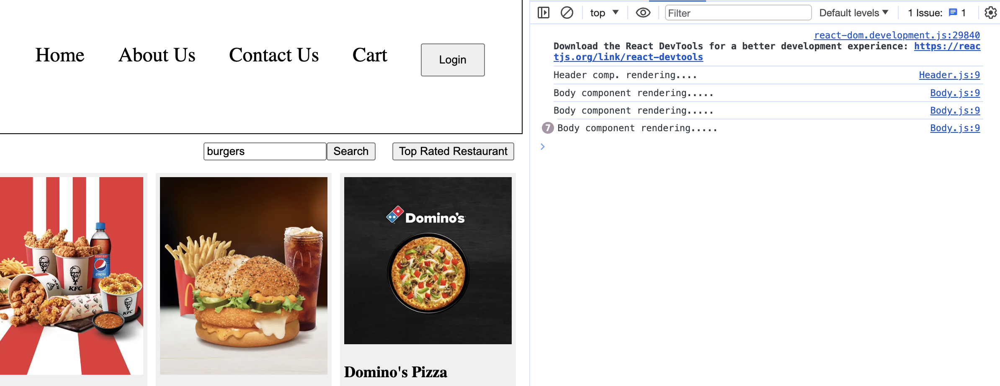

# react-tuts

# Episode 6
- Topics:
- Monolith Architecture.
- Microservices.
- useEffect Hook.
- CORS Chrome Extension
- Shimmer UI
- Conditional Rendering
- Reconciliation & Diff Algorithm.
- OnChange handler.
- Building a Search Functionality.
- Working with the API data.

# Monolith Architecture
- Everything in a single app
- If you make any changes then whole app need to be re-build
- Here generally, we have application written in one language.

# Microservices
- All the services talk to each other depending upon the use cases
- Notification, UI, Auth, Backend, Database, etc services.
- Here we follow single responsibility principle, where each and every service have its own job. No, one is interfering with it.
- Each and everything we have a different service. This is known as separation of concerns.
- Here we can have microservices written in different languages and they are interacting with each other.
- All services run there specific ports and domains E.g. /api:3333 for all apis, /sms:3334 for sms service.
- How these services talk to each other?
    - By calling

# Fetching Data from Backend
- Two ways
    - 1. As soon as our app loads, make an API call and waits for the response and after that only UI will render
    - 2. As soon as page loads, render UI and now make the API call and when API gives response then we will populate UI with that data
- With React, we uses the second method because the second one is better approach and gives better UX. 
- As React's render cycle is very fast so, rendering twice is not a problem.

# CORS Policy
- Our browsers is not allow to call swiggy api from one host to another host i.e. localhost. This is CORS policy error.
- https://www.youtube.com/watch?v=tcLW5d0KAYE
- 

# Shimmer UI
- We load a fake page until the data loads and that Real UI gets rendered.
- The idea of shimmer UI is you want to show something to the user very quickly.
- It is psychologically better. It doesn't give a impression that your website is slow.

# Conditional Rendering
- If you have condition and you render according to the condition it is known as conditional rendering.

# Why we have useState()?
- If you make JS variable and try to make them dynamic, these variables will get updated but their updated values won't be get rendered on the UI, because we didn't created any mechanism for it to show on the UI. So, due to this we need React state variable, it will automatically update the UI as the state changes.
- Why even having the const while declaring the useState() we are able to change the variable?
    - It is happening because as soon as you update state variable using its set method, the set method internally calls the component with the updated value and this time when the component is rendering it creates a new variable with updated default value. So, this time the variable which is showing the updated state is not the same as showing old state. So, this is why we need state variables.
- Whenever the state variable will be changed using the setBtnName, React will re-render the header component (Refresh the header component). It triggered the reconciliation cycle.
- IMP: When a state changes in a component the whole component gets re-rendered not just the elements depending upon the state.

- Rendering a component means calling the component once again.
- When you click the Login button, react behind the scenes triggers the diff algo and compare the old and new header comp object and after seeing it only requires updation in button it do in the UI.

# Search
- The value of input box is tied to the searchText state variable so every time you type something in the input box it resets to the value set for the searchText.
- So, we need a way so that searchText value can be updated as we type in the input box.
- ONCE AGAIN: Whenever state variables update, react triggers a reconciliation cycle (re-renders the component).
- So, whenever you are updating the searchText, react is refreshing the UI again and again, rendering body component. It is so fast that you are not even realizing it.

- React is re-rendering the whole body component but it is only updating input box value inside the DOM.